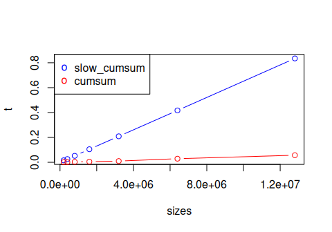
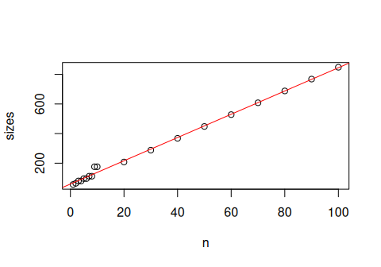
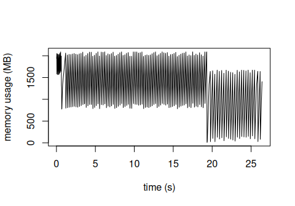
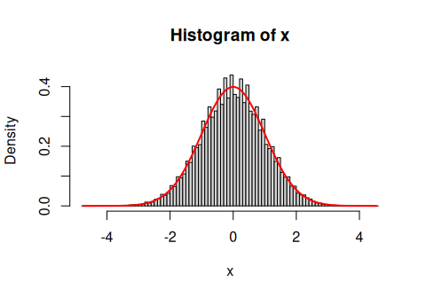
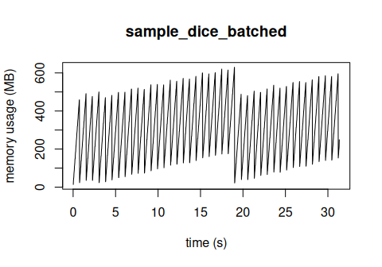

# 1. CPU

### Ex 1

Measure the execution time of `slow_cumsum()` and `cumsum()` with
different sizes of the vector `x`. Plot the results for comparison.

### Ex 2

The function below is even worse than `slow_cumsum()`:

    atrocious_cumsum <- function(x) {
      # we will "build up" the cumulative sum as we iterate over x
      result <- c()
      for (x_elem in x) {
        if (is.null(result)) {
          # if the result is empty, we start with just x[1]
          result <- x_elem
        } else {
          # otherwise we append to the result the sum of the current
          # element of x and the last element of result
          result <- c(result, result[length(result)]+x_elem)  # DON'T!!! ;(
        }
      }
      result
    }

Profile this function. Where does it spend the most time?

## Ex 3

Let *x* be a numeric matrix of size 10000 × 10000. Try adding random
numbers to:

1.  100 randomly chosen **rows** of *x*,
2.  100 randomly chosen **columns** of *x*.

Benchmark both variants. Which one is faster? Why?

    ##      expr      min       lq     mean   median       uq       max neval
    ## 1 rowwise 76.11737 77.36295 79.12606 78.27375 80.29271  85.39909   100
    ## 2 colwise 60.02458 60.60106 65.69465 61.19346 62.18560 436.03279   100

# 2. Memory

### Ex 4

Generate vectors of random numbers of type `integer` and `float` and
sizes from 1 to 1000. Try to determine:

-   how many bytes does an individual element take?
-   how large is the overhead per the entire vector?

Plot the object size depending on length.

    ## 
    ## Call:
    ## lm(formula = sizes ~ n)
    ## 
    ## Coefficients:
    ## (Intercept)            n  
    ##      59.250        7.856

### Ex 5

Profile and plot the memory usage of `atrocious_cumsum()`. Explain the
pattern.

### Ex 6

Compare the memory usage of k-means clustering and hierarchical
clustering (the latter together with the distance matrix calculation).
Try different dataset sizes!

You can use the word embeddings dataset.

# 3. Functional programming

**Note:** In all the exercises in this section, use the functional
programming style.

### Ex 7

Write a function `powers(a, b)` that for two vectors *a*, *b* calculates
a matrix *C*, with
*c**i**j* = *a**i**b**j*.

    powers(c(2, 3, 5, 6), 1:3)

    ##      [,1] [,2] [,3]
    ## [1,]    2    4    8
    ## [2,]    3    9   27
    ## [3,]    5   25  125
    ## [4,]    6   36  216

### Ex 8

Write a function `binary(x)` that for a vector of integers `x` returns a
matrix of binary representations of numbers from `x`: each row is a
sequence of zeros and ones.

    binary(1:10)

    ##       [,1] [,2] [,3] [,4]
    ##  [1,]    1    0    0    0
    ##  [2,]    0    1    0    0
    ##  [3,]    1    1    0    0
    ##  [4,]    0    0    1    0
    ##  [5,]    1    0    1    0
    ##  [6,]    0    1    1    0
    ##  [7,]    1    1    1    0
    ##  [8,]    0    0    0    1
    ##  [9,]    1    0    0    1
    ## [10,]    0    1    0    1

### Ex 9

Generalize the function from the previous exercise to
`radix(x, base = 2)` which computes a representation with any base (2 =
binary, 8 = octal etc.).

    radix(c(1, 8, 11, 16), base = 8)

    ##      [,1] [,2]
    ## [1,]    1    0
    ## [2,]    0    1
    ## [3,]    3    1
    ## [4,]    0    2

### Ex 10

The “3 vs 2 dice” game from the lecture involves rolling 5 six-sided
dice - the number of possible combinations is only 65 = 7776.

Calculate the probability of winning with 3 dice brute-force - by
enumerating all possible results.

*Hint:* use the `radix()` function to convert single numbers to results
on five dice (five-“digit” numbers in representation with base 6).

    dice_game_bruteforce()

    ## [1] 0.7785494

### Ex 11

The Central Limit Theorem says that a standardized mean of *n*
independent identically distributed random variables approaches the
standard Normal distribution with increasing *n*. Let’s test it!

Define a function `sample_dice(n, m)` that does the following:

-   generate *n* experiments of *m* dice rolls each,
-   for each experiment, calculate the mean score,
-   standardize: subtract $\frac{7}{2}$ (mean) and divide by
    $\sqrt{\frac{105}{36}m^{-1}}$ (standard deviation).

Plot a histogram of the sample and draw the standard Normal distribution
for reference.

    x <- sample_dice(100000, 1000)
    hist(x, probability=T, breaks=100)
    nx <- seq(min(x), max(x), length.out=1000)
    lines(nx, dnorm(nx), lwd=2, col='red')

### Ex 12

For large samples, the function `sample_dice()` has high memory
consumption - it generates all dice rolls at once. Write a function
`sample_dice_batched(n, m, batch_size)` that generates `n` experiments
in total, but only up to `batch_size` at once.

Profile the memory usage of both functions!

