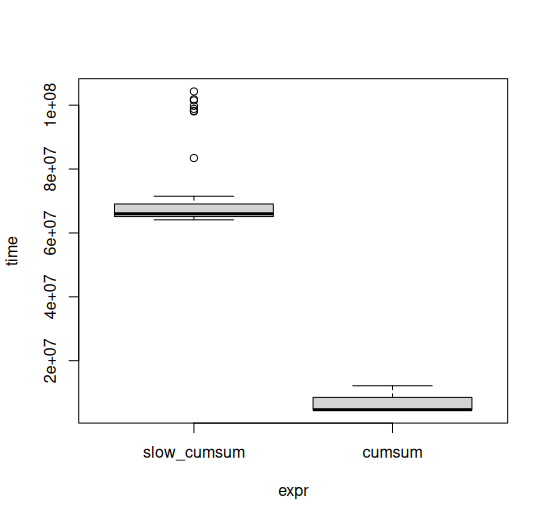

# High Performance R is about...

1.  Writing performant R code
    -   optimization
    -   profiling
2.  Running R code on HPC systems
    -   leveraging multi-core and multi-node computations
    -   avoiding waste of resources

# How to optimize R code?

R is a **high-level** programming language:

* you are not *implementing* algorithms, you are *calling* algorithms,
* implementation often done in C++ or Fortran,
* memory and CPU usage often governed by the specific package.

Basic rules:

* use built-in functions and existing packages whenever possible,
* check for performance-related settings in your packages.

# Idea

The same thing can be achieved in slower or faster ways.

**Example**: Cumulative sum

$$
\begin{eqnarray*}
y_1 &=& x_1 \\
y_{i+1} &=& y_i + x_{i+1}
\end{eqnarray*}
$$

<center>
|   | $\cdot_1$  | $\cdot_2$  | $\cdot_3$  | $\cdot_4$  | $\cdot_5$ |
|--:|----:|----:|----:|----:|----:|
| $x_\cdot$ |  1  |  2  |  3  |   4 |  5 |
| $y_\cdot$ |  1  |  3  |  6  |   10 | 15 |
|  |  =1  | =1+2  |  =1+2+3  |  =1+2+3+4 | =1+2+3+4+5 |
</center>

# Cumulative sum

:::: {.columns}

::: {.column}

<font style="font-weight: bold; color: var(--csc-magenta);">WRONG</font>

```r
slow_cumsum <- function(x) {
  result <- rep(0, length(x))
  result[1] <- x[1]
  for (i in 2:length(x)) {
    result[i] <- result[i-1] + x[i]
  }
  result
}
```

```txt
> x <- c(1, 2, 3, 4, 5)
> slow_cumsum(x)
[1]  1  3  6 10 15
```

:::

::: {.column}

<font style="font-weight: bold; color: var(--csc-green);">RIGHT</font>

```txt
> x <- c(1, 2, 3, 4, 5)
> cumsum(x)
[1]  1  3  6 10 15
```

:::

::::

# Measuring execution time: `Sys.time()`

:::: {.columns}
::: {.column}
<small>CODE</small>
:::
::: {.column}
<small>OUTPUT</small>
:::
::::

:::: {.columns}

::: {.column}

```r
x <- rchisq(1000000, df = 1)

t <- Sys.time()
y <- slow_cumsum(x)
Sys.time()-t
```

:::

::: {.column}
:::

::::

:::: {.columns}

::: {.column}
:::

::: {.column}

```txt
Time difference of 0.1100259 secs
```

:::

::::

:::: {.columns}

::: {.column}

```r
t <- Sys.time()
y <- cumsum(x)
Sys.time()-t
```

:::

::: {.column}
:::

::::

:::: {.columns}

::: {.column}
:::

::: {.column}

```txt
Time difference of 0.006928682 secs
```

:::

::::

# Measuring execution time: `system.time()`

:::: {.columns}
::: {.column}
<small>CODE</small>
:::
::: {.column}
<small>OUTPUT</small>
:::
::::

:::: {.columns}

::: {.column}

```r
x <- rchisq(1000000, df = 1)
system.time({ y <- slow_cumsum(x) })
```

:::

::: {.column}
:::

::::

:::: {.columns}

::: {.column}
:::

::: {.column}

```txt
   user  system elapsed
  0.112   0.007   0.118
```

:::

::::

:::: {.columns}

::: {.column}

```r
system.time({ y <- cumsum(x) })
```

:::

::: {.column}
:::

::::

:::: {.columns}

::: {.column}
:::

::: {.column}

```txt
   user  system elapsed
  0.002   0.000   0.003
```

:::

::::

# Measuring execution time: package `tictoc`

:::: {.columns}
::: {.column}
<small>CODE</small>
:::
::: {.column}
<small>OUTPUT</small>
:::
::::

:::: {.columns}

::: {.column}

```r
library(tictoc)
x <- rchisq(1000000, df = 1)

tic()
y <- slow_cumsum(x)
toc()
```

:::

::: {.column}
:::

::::

:::: {.columns}

::: {.column}
:::

::: {.column}

```txt
0.126 sec elapsed
```

:::

::::

:::: {.columns}

::: {.column}

```r
tic()
y <- cumsum(x)
toc()
```

:::

::: {.column}
:::

::::

:::: {.columns}

::: {.column}
:::

::: {.column}

```txt
0.007 sec elapsed
```

:::

::::

# Comparing execution time: package `microbenchmark`

:::: {.columns}

::: {.column}

```r
library(microbenchmark)
x <- rchisq(1000000, df = 1)

mb <- microbenchmark(
    slow_cumsum={ slow_cumsum(x) },
    cumsum={ cumsum(x) },
    unit='s',
    times=100    # repeat each call 100 times
)
plot(mb)
```

:::

::: {.column}



:::

::::


# 'Premature optimization is the root of all evil'

Typically rather in
<font style="color: var(--csc-magenta); font-weight: bold">low-level</font>
programming:

* optimization can sometimes make the code more complicated 
* first, focus on writing the code in the **most understandable** way
* code too slow? -> profile and identify bottlenecks
* optimize the most resource-intensive parts

But in a <font style="color: var(--csc-green); font-weight: bold">high-level</font>
language (such as R) usually:

<p align="center">
most concise = most understandable = most performant</p>

# Profiling with `Rprof`

:::: { .columns }

::: { .column }

* sample the call stack every 0.02 s (by default)
* write results to file `Rprof.out`

:::

::: { .column }

```r
Rprof()                    # enable profiling
# load and format data
df <- read.table('model.txt',
	skip=1, quote='',
	comment.char='', nrows=10000)
rownames(df) <- df[,1]
df <- df[,2:ncol(df)]
# run clustering
kmc <- kmeans(df,
	centers = 100, iter.max = 100)
Rprof(NULL)                # disable profiling
summaryRprof()             # display results
```

:::

::::

<small>
`model.txt` contains word embeddings trained on the British National Corpus,
available at:
[https://vectors.nlpl.eu/repository/20/0.zip](https://vectors.nlpl.eu/repository/20/0.zip)
</small>

# Profiling with `Rprof`

:::: { .columns }

::: { .column width="40%" }

* loading data: 35%
* clustering: 65%

:::

::: { .column width="60%" }

<small>
```txt
> summaryRprof()

...

$by.total
                       total.time total.pct self.time self.pct
"kmeans"                     2.48     65.26      0.00     0.00
".Fortran"                   2.42     63.68      2.42    63.68
"do_one"                     2.42     63.68      0.00     0.00
"read.table"                 1.32     34.74      0.02     0.53
"scan"                       1.00     26.32      1.00    26.32
"type.convert.default"       0.30      7.89      0.00     0.00
"type.convert"               0.30      7.89      0.00     0.00
".External2"                 0.26      6.84      0.26     6.84
"eval"                       0.04      1.05      0.04     1.05
"match.arg"                  0.04      1.05      0.00     0.00
"array"                      0.02      0.53      0.02     0.53
"sum"                        0.02      0.53      0.02     0.53
"unlist"                     0.02      0.53      0.02     0.53
"aperm"                      0.02      0.53      0.00     0.00
"as.matrix.data.frame"       0.02      0.53      0.00     0.00
"as.matrix"                  0.02      0.53      0.00     0.00
"scale.default"              0.02      0.53      0.00     0.00
"scale"                      0.02      0.53      0.00     0.00
"sweep"                      0.02      0.53      0.00     0.00
```
</small>

:::

::::
