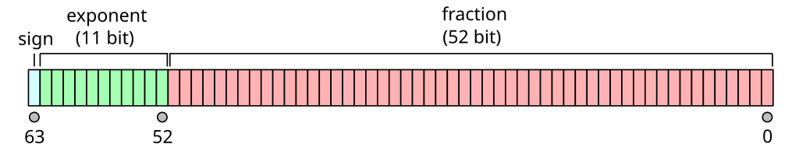
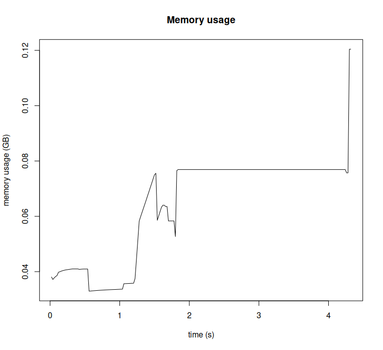

# Data types

:::::: {.columns}

::::: {.column}

A **data type** defines how the data is represented in the memory.

Primitive data types:

- numbers (`integer`, `double`)
- character strings (`character`)
- logical values (`logical`)

:::::

::::: {.column}

:::: {.columns}
::: {.column}
<small>CODE</small>
:::
::: {.column style="text-align: right;"}
<small>OUTPUT</small>
:::
::::

:::: {.columns}
::: {.column width="60%"}
```r
x <- 42
typeof(x)
```
:::
::: {.column width="40%"}
:::
::::

:::: {.columns}
::: {.column width="40%"}
:::
::: {.column width="60%"}
```txt
[1] "double"
```
:::
::::

:::: {.columns}
::: {.column width="60%"}
```r
object.size(x)
```
:::
::: {.column width="40%"}
:::
::::

:::: {.columns}
::: {.column width="40%"}
:::
::: {.column width="60%"}
```txt
56 bytes
```
:::
::::

:::: {.columns}
::: {.column width="60%"}
```r
w <- "example"
typeof(w)
```
:::
::: {.column width="40%"}
:::
::::

:::: {.columns}
::: {.column width="40%"}
:::
::: {.column width="60%"}
```txt
[1] "character"
```
:::
::::

:::: {.columns}
::: {.column width="60%"}
```r
object.size(w)
```
:::
::: {.column width="40%"}
:::
::::

:::: {.columns}
::: {.column width="40%"}
:::
::: {.column width="60%"}
```txt
112 bytes
```
:::
::::

:::::

::::::

# Example: double-precision floating point number

<center>

</center>

$$
x = (-1)^\text{sign} \left( 1 + \sum_{i=1}^{52} b_{52-i}2^{-i} \right) \times
  2^{E - 1023}
$$

&nbsp;

<small>
source: [https://en.wikipedia.org/wiki/Double-precision_floating-point_format](https://en.wikipedia.org/wiki/Double-precision_floating-point_format)
</small>

# Strings vs. factors

:::::: {.columns}

::::: {.column}

**Factors** store categorical variables in an efficient way.

:::::

::::: {.column}

:::: {.columns}
::: {.column}
<small>CODE</small>
:::
::: {.column style="text-align: right;"}
<small>OUTPUT</small>
:::
::::

:::: {.columns}
::: {.column width="95%"}
```r
df <- read.csv("surveys_complete.csv",
	header=T, stringsAsFactors=T)
typeof(df$genus)
```
:::
::: {.column width="5%"}
:::
::::
:::: {.columns}
::: {.column width="40%"}
:::
::: {.column width="60%"}
```txt
[1] "integer"
```
:::
::::

:::: {.columns}
::: {.column width="60%"}
```r
object.size(df$genus)
```
:::
::: {.column width="40%"}
:::
::::
:::: {.columns}
::: {.column width="40%"}
:::
::: {.column width="60%"}
```txt
122856 bytes
```
:::
::::

:::::

::::::

# Vectors

:::::: {.columns}

::::: {.column}

In R, every variable is a one-dimensional vector by default.

Many functions are *vectorized*, i.e. operate on entire vectors.

:::::

::::: {.column}

:::: {.columns}
::: {.column}
<small>CODE</small>
:::
::: {.column style="text-align: right;"}
<small>OUTPUT</small>
:::
::::

:::: {.columns}
::: {.column width="70%"}
```r
x <- c(1, 1, 2, 3, 5, 8)
typeof(x)
```
:::
::: {.column width="30%"}
:::
::::
:::: {.columns}
::: {.column width="40%"}
:::
::: {.column width="60%"}
```txt
[1] "double"
```
:::
::::

:::: {.columns}
::: {.column width="60%"}
```r
length(x)
```
:::
::: {.column width="40%"}
:::
::::
:::: {.columns}
::: {.column width="40%"}
:::
::: {.column width="60%"}
```txt
[1] 6
```
:::
::::

:::: {.columns}
::: {.column width="60%"}
```r
2^x
```
:::
::: {.column width="40%"}
:::
::::
:::: {.columns}
::: {.column width="20%"}
:::
::: {.column width="80%"}
```txt
[1]   2   2   4   8  32 256
```
:::
::::

:::::

::::::

# Named vectors

:::::: {.columns}

::::: {.column}

Vectors can include *names* attached to each element.

Names can be used for indexing.

:::::

::::: {.column}

:::: {.columns}
::: {.column}
<small>CODE</small>
:::
::: {.column style="text-align: right;"}
<small>OUTPUT</small>
:::
::::

:::: {.columns}
::: {.column width="80%"}
```r
x <- c(1, 2, 3)
names(x) <- c("ab", "cd", "ef")
x["ef"]
```
:::
::: {.column width="20%"}
:::
::::

:::: {.columns}
::: {.column width="70%"}
:::
::: {.column width="30%"}
```txt
ef
 3
```
:::
::::

:::: {.columns}
::: {.column width="80%"}
```r
x <- c(ab = 1, cd = 2, ef = 3)
x["ef"]
```
:::
::: {.column width="20%"}
:::
::::
:::: {.columns}
::: {.column width="70%"}
:::
::: {.column width="30%"}
```txt
ef
 3
```
:::
::::

:::::

::::::

# Implicit type conversion

:::::: {.columns}

::::: {.column}

* Follows the hierarchy: <br/>
  logical -> numeric -> character
  * numeric -> logical<br/> prints a warning
* Useful for concise expressions!

:::::

::::: {.column}

:::: {.columns}
::: {.column}
<small>CODE</small>
:::
::: {.column style="text-align: right;"}
<small>OUTPUT</small>
:::
::::

:::: {.columns}
::: {.column width="60%"}
```r
x <- c(T, F, F, T, F)
x
```
:::
::: {.column width="40%"}
:::
::::

:::: {.columns}
::: {.column width="15%"}
:::
::: {.column width="85%"}
```txt
[1]  TRUE FALSE FALSE  TRUE FALSE
```
:::
::::

:::: {.columns}
::: {.column width="60%"}
```r
mean(x)
```
:::
::: {.column width="40%"}
:::
::::

:::: {.columns}
::: {.column width="40%"}
:::
::: {.column width="60%"}
```txt
0.4
```
:::
::::

:::: {.columns}
::: {.column width="60%"}
```r
x * 5
```
:::
::: {.column width="40%"}
:::
::::

:::: {.columns}
::: {.column width="40%"}
:::
::: {.column width="60%"}
```txt
[1] 5 0 0 5 0
```
:::
::::

:::: {.columns}
::: {.column width="60%"}
```r
paste('=', x*5)
```
:::
::: {.column width="40%"}
:::
::::

:::: {.columns}
::: {.column width="10%"}
:::
::: {.column width="90%"}
```txt
[1] "= 5" "= 0" "= 0" "= 5" "= 0"
```
:::
::::

:::::

::::::

# Lists

:::::: {.columns}

::::: {.column}

Lists are R's way of creating complex data structures:

* can be nested,
* elements can be named,
* elements can be of different types.

:::::

::::: {.column}

```r
x <- list(
    apples  = c(1, 2, 3),
    pears   = c('a', 'b', 'c'),
    oranges = list(c(T, F), 7)
)
```

:::::

::::::

# Lists

:::::: {.columns}

::::: {.column}

Lists **should not** be used where vectors can.

* larger memory usage,
* unable to use vectorized computations ->
  <font style="font-weight: bold; color: var(--csc-magenta)">slow!</font>

:::::

::::: {.column}

:::: {.columns}
::: {.column}
<small>CODE</small>
:::
::: {.column style="text-align: right;"}
<small>OUTPUT</small>
:::
::::

:::: {.columns}
::: {.column width="60%"}
```r
x <- rnorm(1000)
object.size(x)
```
:::
::: {.column width="40%"}
:::
::::

:::: {.columns}
::: {.column width="40%"}
:::
::: {.column width="60%"}
```txt
8048 bytes
```
:::
::::

:::: {.columns}
::: {.column width="60%"}
```r
x_lst <- as.list(x)
object.size(x_lst)
```
:::
::: {.column width="40%"}
:::
::::

:::: {.columns}
::: {.column width="40%"}
:::
::: {.column width="60%"}
```txt
64048 bytes
```
:::
::::

:::::

::::::

:::::: {.columns}

::::: {.column width="60%" }

```r
microbenchmark(
	vec = { x * 3 },
	lst = { lapply(x_lst, function(u) u * 3) })
```

:::::

::::: {.column width="40%" }
:::::

::::::

:::::: { .columns }

::::: {.column width="40%" }
:::::

::::: {.column width="60%" }

<small>
```txt
Unit: nanoseconds
 expr    min       lq      mean   median       uq     max neval
  vec    842   1202.0   1650.17   1503.0   1788.5    8877   100
  lst 493596 529132.5 546027.24 536080.5 543088.5 1755412   100
```
</small>

:::::

:::::::

# Data frames

:::::: {.columns}

::::: {.column}

Data frames are *lists* with additional conditions:

* each element ("column") is a vector,
* all elements have equal length.

:::::

::::: {.column}

:::: {.columns}
::: {.column}
<small>CODE</small>
:::
::: {.column style="text-align: right;"}
<small>OUTPUT</small>
:::
::::

:::: {.columns}
::: {.column width="80%"}
```r
x <- data.frame(
    name = c("ab", "cd", "ef"),
    idx = c(1, 2, 3)
)
typeof(x)
```
:::
::: {.column width="20%"}
:::
::::

:::: {.columns}
::: {.column width="40%"}
:::
::: {.column width="60%"}
```txt
[1] "list"
```
:::
::::

:::: {.columns}
::: {.column width="60%"}
```r
lapply(x, typeof)
```
:::
::: {.column width="40%"}
:::
::::

:::: {.columns}
::: {.column width="40%"}
:::
::: {.column width="60%"}
```txt
$name
[1] "character"

$idx
[1] "double"
```
:::
::::

:::::

::::::

# Copy-on-modify

:::::: {.columns}

::::: {.column}

Several identifiers can point to the same value in memory.

But if one of them is modified, the entire data structure is copied.

:::::

::::: {.column}

:::: {.columns}
::: {.column}
<small>CODE</small>
:::
::: {.column style="text-align: right;"}
<small>OUTPUT</small>
:::
::::

:::: {.columns}
::: {.column width="90%"}
```r
x <- c(1, 2, 3, 4, 5)
# y points to the same vector as x
y <- x
y
```
:::
::: {.column width="10%"}
:::
::::

:::: {.columns}
::: {.column width="40%"}
:::
::: {.column width="60%"}
```txt
[1] 1 2 3 4 5
```
:::
::::

:::: {.columns}
::: {.column width="90%"}
```r
# now the whole vector is copied!
y[3] <- 8
y
```
:::
::: {.column width="10%"}
:::
::::

:::: {.columns}
::: {.column width="40%"}
:::
::: {.column width="60%"}
```txt
[1] 1 2 8 4 5
```
:::
::::

:::: {.columns}
::: {.column width="60%"}
```r
x
```
:::
::: {.column width="40%"}
:::
::::

:::: {.columns}
::: {.column width="40%"}
:::
::: {.column width="60%"}
```txt
[1] 1 2 3 4 5
```
:::
::::

:::::

::::::

# Memory management

<font style="font-weight: bold; color: var(--csc-magenta);">Low-level</font> (e.g. C)

* Need to store data? -> First, *allocate* the memory from the OS
  * need to know in advance how much,
* The memory is held until *explicitly* released,
* Mistakes in this have nasty consequences.

<font style="font-weight: bold; color: var(--csc-green);">High-level</font> (R)

* For new objects, the memory is automatically reserved,
* Object no longer needed? -> the *garbage collector* releases the memory.

# Garbage collector

:::: {.columns}

::: {.column}

An object becomes 'garbage' if it is no longer accessible:

* out of scope
  * e.g. local variables in functions,
* the identifier was reassigned to something else, like:
  ```r
  x <- rnorm(1000000)
  x <- 10              # where is my sample?!
  ```
* explicitly deleted with `rm()`.

:::

::: {.column}

The garbage collector is triggered:

* automatically, if the memory usage exceeds a threshold,
  * also, a new threshold is set,
* manually with `gc()`
  * hardly ever needed

More info: `help(Memory)`

:::

::::

# Memory profiling with `Rprof`

:::: {.columns}

::: {.column}

```r
Rprof(memory.profiling=T)   # enable profiling
df <- read.table('model.txt',
	skip=1, quote='',
	comment.char='', nrows=10000)
rownames(df) <- df[,1]
df <- df[,2:ncol(df)]
kmc <- kmeans(df,
	centers = 100, iter.max = 100)
Rprof(NULL)                # disable profiling

# display results
s <- summaryRprof(memory='ts', diff=F)
plot(as.numeric(rownames(s)),
     (s$vsize.small+s$vsize.large) / 1024^3,
     main='Memory usage', xlab='time (s)',
     ylab='memory usage (GB)', type='l')
```

:::

::: {.column}



:::

::::

# Memory usage optimization

* use efficient data types and structures,
  * generally: vectors wherever possible,
  * task-specific: e.g. sparse matrices,
* do not keep data in memory longer than necessary,
  * `rm()` and `gc()` usually not needed, just well-structured code -> functions!
  * beware of *copy-on-modify*,
* avoid *growing objects* (see exercise: `atrocious_cumsum()`).
