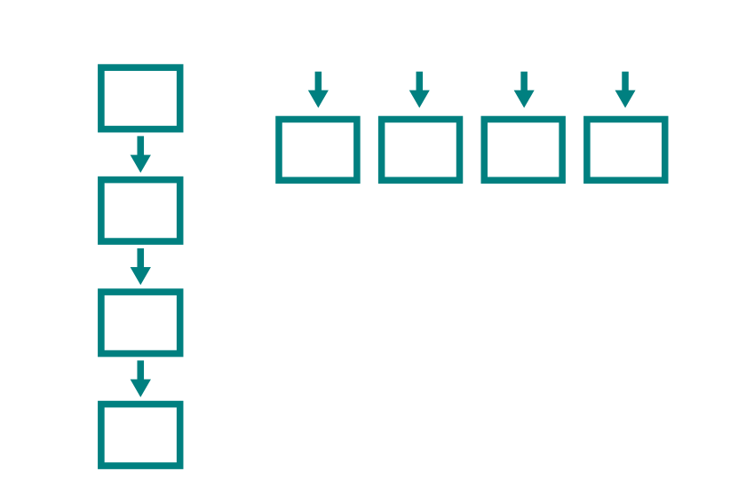
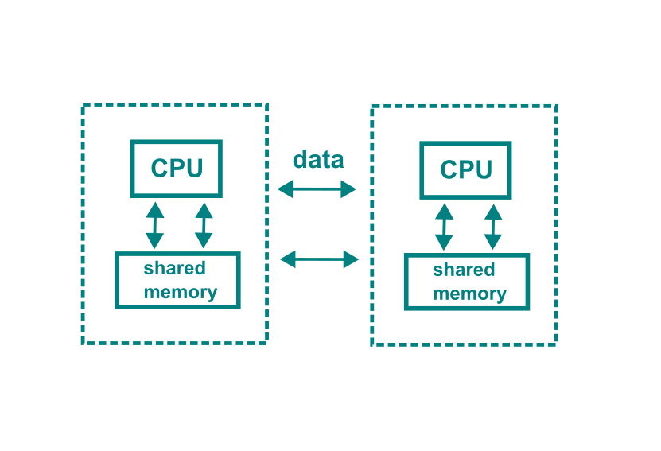

# Problems being solved

-   **slow** → faster: computing power as bottleneck → can the task use multiple cores?

-   **many** → more at once: carrying out similar, independent tasks/data sets concurrently

-   **big** → memory as a bottleneck - day 1 & later on day 2

# Serial vs. parallel

{fig-align="left"}

# What can be parallelized?

-   independent computations using multiple cores/computers
-   data: independent chunks of data
    -   separate sets of data to be processed in the same way
    -   split/apply/combine
-   tasks: list of similar, independent tasks
    -   can't depend on the results of the others

# *Embarassingly parallel* tasks

-   a number of similar independent subtasks
-   several data sets analyzed in the same way
-   same simulation code executed with different parameters

# One R session, one core

-   by default, R processes use one core / thread
-   lots of cores available doesn't guarantee that R script uses them
-   parallel processing
    -   built in to the package or
    -   set up in the R script with specific packages

# Built-in parallelism in R packages

-   R packages that are built to use multiple cores
-   the easiest way to speed up and scale up
-   under the hood: R packages for multiprocessing or C-based multithreading

# How to know if an R package uses multiple cores/threads?

-   manual, web pages, publications
-   arguments - cores, threads?
-   check package code
-   test performance - does adding cores/threads speed up the job?

# Detecting the number of cores

-   commonly: `parallel::detectCores()`
-   on HPC systems, use `parallelly::availableCores()`

``` r
Sys.getenv("SLURM_CPUS_PER_TASK")
# [1] "3"
parallel::detectCores()
# [1] 40
parallelly::availableCores()
# /proc/self/status 
#               3 
```

# Multiprocessing

-   specific packages: `parallel`, `future`, `foreach`, `snow`, `mirai` ...
-   set up a cluster of multiple cores to run multiple processes
-   one process per core
-   **master process** guides multiple **worker processes**

# Two types of clusters

-   **fork cluster**: original process cloned to new cores
    -   not available in Windows, in RStudio
-   **socket cluster**: new process launched on each core
    -   slower than forking, higher memory use
    -   packages, variables may be undefined in the new processes

# Multithreading

-   one process uses many cores: one thread per core
-   threads share memory
-   built into a package at C/C++ level (BLAS/LAPACK libraries for multithreading)
-   on Puhti/Mahti: OpenMP threading (Intel Math Kernel Library)
-   speeds up for example linear algebra

# Caveats for threading

-   only works with packages built to use threading → R package manual
-   watch out for mixing both multiple processes and multiple threads

# Multiple nodes: distributed computing

-   nodes = separate computers
    -   no shared memory
-   MPI = Message Passing Interface
-   specific R packages handle the communication between nodes
    -   `snow`, `future`, `pbdMPI`, ...

# Multiple nodes: distributed computing



# Tips for parallel R jobs

-   compare execution time of serial vs. parallel
-   start small, then scale up
-   parallelization has costs
    - very short tasks in parallel → no speed up
-   look for an optimal number of cores/threads
    - more is not always faster
-   load balancing: similar sizes of concurrent tasks to avoid idle resources
-   parallel random number generation
