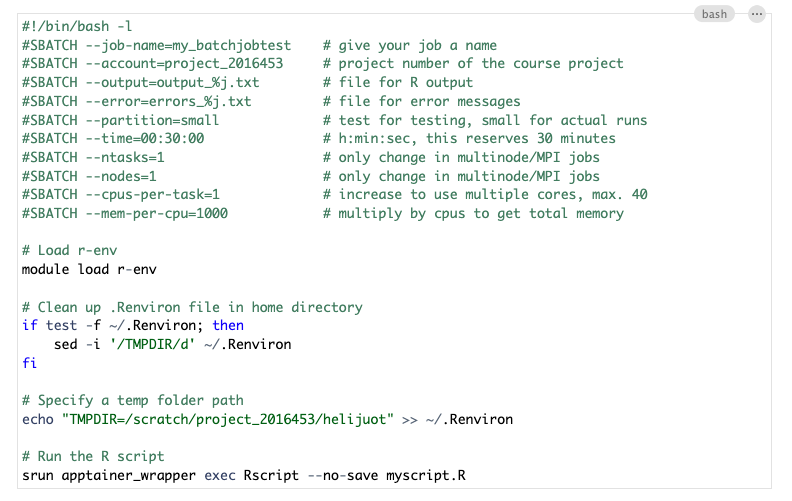
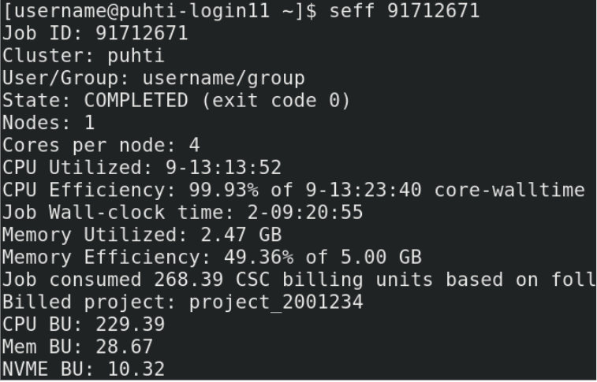

# Why run R on an HPC cluster?

-   HPC = high performance computing
-   more resources: cores, memory, long runs
-   one core not much faster than on a normal computer\
    → **parallelization** to use many cores
-   pre-installed software
    -   R environment and packages

# Overview of CSC's computing services


# Coming in 2026: Roihu

-   replaces both Puhti and Mahti
-   available in March 2026


More information: <https://docs.csc.fi/computing/systems-roihu/>

# What happens to Puhti and Mahti?

-   Puhti *compute* closes 1 month afterwards
-   Puhti *storage* closes in July 2026
-   Mahti closes in August 2026

# Short introduction to supercomputers

:::: {.columns}

::: {.column }


:::

::: {.column }

<br>
<br>

-   one node on Puhti: 40 cores
-   one node on Mahti: 128 cores
-   one node on Roihu: 2 x 192 cores

:::

::::

Images from <https://csc-training.github.io/csc-env-eff/>

# High performance computing cluster

:::: {.columns}

::: {.column }


:::

::: {.column }

<br>

- node: lots of cores
- HPC cluster: lots of nodes

:::

::::

# A closer look at Puhti

:::: {.columns}

::: {.column }


:::

::: {.column }

- login nodes: no heavy computation!
- compute nodes
- file system
  - home: personal, 10 GB
  - `/projappl`: installations
  - `/scratch`: data for computations
:::

::::

# SLURM job scheduler


# R environment on Puhti & Mahti

-   module `r-env`

``` r
module load r-env
```

-   loads the latest R version available on Puhti: <br><https://docs.csc.fi/apps/r-env/#available>
-   currently: R v. 4.5.1
-   loading a specific R version:

``` r
module load r-env/451
```

# r-env is a container-based module

-   self-contained environment
    -   limitations with using other modules on Puhti
    -   combining R and Python
-   RStudio Terminal panel: inside the container

# R packages in r-env

-   over 1600 packages installed
-   packages of each R version **date-locked** to a specific date
    -   avoid conflicts between versions
    -   increase reproducibility
        -   package versions only updated in a new R version
-   avoid updating packages when installing new ones

# Adding new packages

-   default package directory is write-protected

1)  install yourself for your project in projappl <br>
see: <https://docs.csc.fi/apps/r-env/#r-package-installations>
2)  ask for a general installation for all users (email servicedesk\@csc.fi)

# Interactive R on Puhti

-   **RStudio:** Puhti web interface (or ssh tunnelling)
-   **console R**
    -   compute node shell
    -   sinteractive on terminal

``` r
module load r-env
start-r
```

# Interactive R on Puhti

-   get started, develop and test R scripts
-   light or medium heavy interactive work up to a few hours
-   uses fast local storage (NVMe) for storing temporary files (local disk)
-   limitations on resources
    -   RStudio struggles → move to **batch jobs**

# Non-interactive R on Puhti: batch jobs

-   R script (.R)
    -   all R commands to be run
-   batch job script (.sh)
    -   reserves resources, loads modules, sets up environment
    -   bash script with a specific format

# Basic template for R batch job script on Puhti



# Submitting batch jobs

-   submitted on the login node
    -   login node shell in the Puhti web interface
    -   ssh on a terminal
-   by default, output and error files go to the same folder where job was submitted

``` bash
sbatch my_batch_job.sh
```

# Status of a batch job

To view the status of the job:

``` bash
squeue -u $USER
# or
squeue --me
```

To cancel a submitted job:\
- job id is shown on the terminal when you submit the job

``` bash
scancel <job_id>
```

# Resource use: seff

When the job has finished, check the resources it used:

``` bash
seff <job_id>
```



